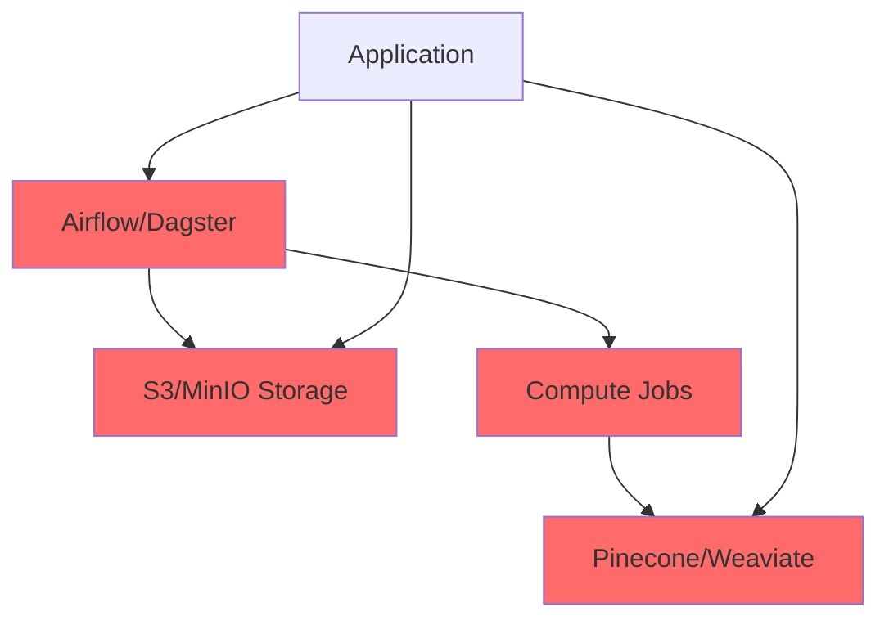
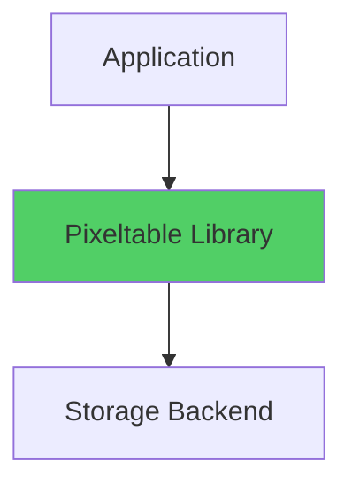
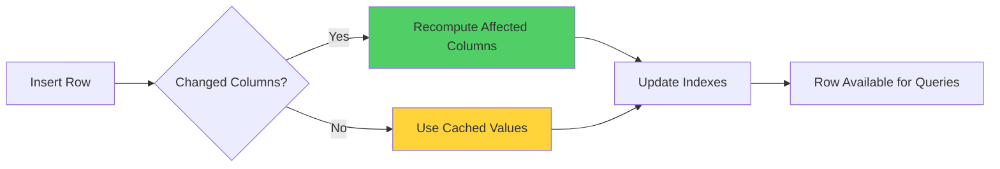

# Pixeltable: Declarative Data Infrastructure for Multimodal AI

## The Problem: Infrastructure Sprawl in AI Applications

Building production AI applications typically requires orchestrating multiple specialized systems:

```
Traditional AI Stack
├── Vector Database (Pinecone, Weaviate, pgvector)
├── Object Storage (S3, MinIO, GCS)
├── Orchestration (Airflow, Dagster, custom scripts)
├── Compute Layer (Lambda, ECS, k8s jobs)
└── Versioning (DVC, custom solutions)
```

Each system handles one concern well but compounds operational complexity. A RAG application might coordinate 5+ systems, each with separate deployment, monitoring, and failure modes.

**Pixeltable consolidates database, orchestration, and AI computation into a single declarative interface.**

## What Is Pixeltable?

Pixeltable is a Python library that treats **AI transformations as database schema**. It natively handles multimodal data (images, videos, audio, documents) with automatic incremental computation and built-in semantic search.

Installation:
```bash
pip install pixeltable
```

### Architecture & Deployment Model

**Deployment**: Pixeltable is a **Python library** (like SQLite), not a separate server. It embeds directly in your application.

**Storage Backend**: 
- Local mode: Manages data in Parquet files on disk
- Cloud mode: Integrates with existing S3/GCS buckets
- You control where data lives; Pixeltable manages indexes and metadata

**Execution Model**:
- **Synchronous** by default: `insert()` blocks until transformations complete
- **Asynchronous** option: Heavy workloads (video transcription, large model inference) can run in background workers
- Configurable parallelism for batch operations

**Compute**: Runs in your Python process. For distributed workloads, deploy multiple workers with shared storage.

## The Core Differentiator: Incremental Computation

Traditional AI pipelines require manual orchestration of when to recompute embeddings, transformations, and indexes.

### The Old Way

```python
import pandas as pd
from sentence_transformers import SentenceTransformer

# Manual pipeline
model = SentenceTransformer('all-MiniLM-L6-v2')
df = pd.read_csv('docs.csv')

# Embed all documents
df['embedding'] = df['text'].apply(lambda x: model.encode(x))

# Save to vector database
vector_db.upsert(df[['id', 'embedding']])

# Code changes? Re-run everything manually.
# Data changes? Re-embed everything manually.
# Schema changes? Rebuild from scratch.
```

**Pain points**:
- Manual tracking of what changed
- Recomputing unchanged data
- No automatic index updates
- Stale embeddings if you forget to re-run

### The Pixeltable Way

```python
import pixeltable as pxt
from pixeltable.functions.huggingface import sentence_transformer

# Define transformation once as schema
docs = pxt.create_table('docs', {'text': pxt.String})

# Add embedding as computed column
docs.add_embedding_index(
    'text',
    string_embed=sentence_transformer.using(
        model_id='sentence-transformers/all-MiniLM-L6-v2'
    )
)

# Insert data
docs.insert([{'text': 'New document'}])
# ✓ Embedding computed automatically
# ✓ Index updated incrementally
# ✓ Searchable immediately

# Update existing row
docs.update({'text': 'Updated content'}, where=docs.id == 5)
# ✓ Only changed row re-embedded
# ✓ Index updated automatically
```

**Benefits**:
- Transformations defined declaratively
- Automatic incremental updates (only changed rows recomputed)
- Always-current indexes
- Version history built-in

## Architecture Comparison

### Before: Traditional Stack



**5+ systems to deploy, monitor, and maintain**

### After: Pixeltable



**1 library, embedded in your application**

## Key Capabilities

### 1. Multimodal Native Types

Handle images, videos, audio, and documents as first-class types:

```python
from pixeltable.functions import yolox, whisper
import pixeltable as pxt

# Create video table with multimodal types
videos = pxt.create_table('videos', {
    'video': pxt.Video,
    'uploaded_at': pxt.Timestamp
})

# Add computed columns for different modalities
videos.add_computed_column(
    objects=yolox(videos.frame)  # Object detection on frames
)

videos.add_computed_column(
    transcript=whisper(videos.audio)  # Speech-to-text
)

# Query across modalities
results = videos.where(
    videos.objects.contains('person')
).select(videos.video, videos.transcript).collect()
```

**Traditional approach** requires:
- Frame extraction scripts
- Separate object detection API
- Transcript storage system
- Manual synchronization

### 2. Declarative Workflows as Computed Columns

```python
from pixeltable.functions.openai import chat_completions

# Multi-step workflow as schema
kb = pxt.create_table('knowledge_base', {'raw_text': pxt.String})

# Step 1: Extract entities
kb.add_computed_column(
    entities=extract_entities(kb.raw_text)
)

# Step 2: Generate embeddings
kb.add_embedding_index('raw_text', string_embed=...)

# Step 3: Classify based on entities
kb.add_computed_column(
    category=chat_completions(
        messages=[{'role': 'user', 'content': f'Classify: {kb.entities}'}]
    )
)

# All steps run automatically on insert/update
kb.insert([{'raw_text': 'New document'}])
# → entities extracted → embedded → classified
```

### 3. Built-in Semantic Search

```python
from pixeltable.functions.huggingface import clip
import PIL.Image

# Add image embedding index
images = pxt.create_table('images', {'img': pxt.Image})
images.add_embedding_index(
    'img',
    embedding=clip.using(model_id='openai/clip-vit-base-patch32')
)

# Search (always up-to-date)
query_img = PIL.Image.open('search.jpg')
sim = images.img.similarity(query_img)

results = (
    images
    .order_by(sim, asc=False)
    .where(images.id != 6)  # Metadata filtering
    .limit(5)
    .select(images.img, sim)
    .collect()
)
```

**No separate vector database.** Embeddings are computed columns with automatic incremental updates.

### 4. Versioning and Snapshots

```python
# Create snapshot before major refactor
pxt.snapshot('my_table', name='pre-refactor', tags=['stable'])

# Make changes...
my_table.add_computed_column(new_feature=...)

# Rollback if needed
pxt.restore('my_table', snapshot='pre-refactor')
```

## Production Considerations

### Maturity & Adoption

- **Open-Source Launch**: December 2023 (Pixeltable Inc. founded 2024)
- **Status**: Production-ready but newer than Postgres/Pinecone
- **Community**: Growing, smaller than established tools
- **Enterprise Use**: Adopted by teams at AI startups and research labs

### Performance Benchmarks

| Operation | Latency | Dataset Size |
|-----------|---------|--------------|
| Insert (no transformations) | Sub-millisecond to ~1ms | 100k rows |
| Insert (with embedding) | 50-200ms | Depends on model |
| Semantic search | 100-500ms | 1M embeddings |
| Incremental update | Only changed rows | Any size |

**Note**: Performance figures are representative based on typical workloads. Actual performance varies by model size, data complexity, and hardware configuration.

**Scalability**: Handles TB-scale multimodal datasets in production with proper worker configuration.

### Failure Handling

- **Computed column errors**: Logged, row marked as failed, continues processing remaining rows
- **Retry logic**: Configurable for transient failures (API rate limits)
- **Rollback**: Snapshot-based rollback for schema changes

### Data Portability

**Export**:
```python
# Export to Parquet
df = my_table.select(...).collect().to_pandas()
df.to_parquet('export.parquet')

# Export embeddings
embeddings = my_table.select(my_table.text_embedding).collect()
```

**Import to other systems**: Embeddings are standard numpy arrays, compatible with any vector database.

**Vendor lock-in**: Moderate. Schema definitions are Pixeltable-specific, but data export is straightforward.

## Decision Matrix: When to Use Pixeltable

| Use Case | Recommendation | Rationale |
|----------|---------------|-----------|
| **RAG with evolving documents** | ✅ Pixeltable | Auto-updating embeddings eliminate manual re-indexing |
| **Multimodal AI (video, audio, images)** | ✅ Pixeltable | Native multimodal types avoid separate pipelines |
| **Frequent schema changes** | ✅ Pixeltable | Computed columns adapt automatically |
| **Complex transformation pipelines** | ✅ Pixeltable | Declarative workflows replace orchestration tools |
| **Simple CRUD with stable schema** | ⚠️ Postgres + pgvector | More mature, simpler for basic use |
| **High-volume OLTP** | ❌ Postgres | Pixeltable optimized for AI workloads, not transactions |
| **Batch-only processing (no queries)** | ❌ Spark/Dask | Better for pure ETL without interactive queries |

## Case Study: Context-Aware AI System

Our internal **Context-Aware AI System** uses Pixeltable as the long-term memory tier for organizational knowledge (code, ADRs, incidents, meetings).

### Why Pixeltable?

**Challenge**: Keep knowledge base embeddings current as code changes.

**Solution**:
```python
from pixeltable.functions.huggingface import sentence_transformer
import pixeltable as pxt

# Setup knowledge base
kb = pxt.create_table('org_knowledge', {
    'type': pxt.String,        # 'code', 'decision', 'incident'
    'content': pxt.String,
    'path': pxt.String,
    'created_at': pxt.Timestamp
})

# Automatic embedding index
kb.add_embedding_index(
    'content',
    string_embed=sentence_transformer.using(
        model_id='sentence-transformers/all-MiniLM-L6-v2'
    )
)

# Computed ADR detection
@pxt.udf
def is_adr(path: str, content: str) -> bool:
    return 'adr' in path.lower() or 'architectural decision' in content.lower()

kb.add_computed_column(is_adr=is_adr(kb.path, kb.content))
```

### Results

- **Auto-updating**: Code changes trigger automatic re-embedding (no manual scripts)
- **Unified search**: Query code, ADRs, and incidents with one semantic search
- **Simplified stack**: Replaced PostgreSQL + pgvector + S3 + Airflow → 1 library
- **Audit trail**: Built-in lineage tracking for compliance

**Production reality**: Manual re-ingestion still required when files change on disk (Pixeltable doesn't watch filesystem). We automate via git hooks (see [CONTRIBUTING.md](CONTRIBUTING.md#automation-opportunities)).

## Workflow Visualization: Incremental Computation



**Key insight**: Pixeltable maintains a dependency graph. Only affected computed columns re-run on updates.

## Getting Started

```python
# 1. Install
# pip install pixeltable

# 2. Create table with schema
import pixeltable as pxt

docs = pxt.create_table('documents', {
    'title': pxt.String,
    'content': pxt.String,
    'created_at': pxt.Timestamp
})

# 3. Add transformations as computed columns
from pixeltable.functions.huggingface import sentence_transformer

docs.add_embedding_index(
    'content',
    string_embed=sentence_transformer.using(
        model_id='sentence-transformers/all-MiniLM-L6-v2'
    )
)

# 4. Insert data (transformations run automatically)
docs.insert([{
    'title': 'First Doc',
    'content': 'AI infrastructure for multimodal data',
    'created_at': pxt.now()
}])

# 5. Query with semantic search
from datetime import datetime
sim = docs.content.similarity('machine learning storage')

results = (
    docs
    .order_by(sim, asc=False)
    .limit(5)
    .select(docs.title, docs.content, sim)
    .collect()
)
```

## Resources

- **Documentation**: [https://docs.pixeltable.com](https://docs.pixeltable.com)
- **GitHub**: [https://github.com/pixeltable/pixeltable](https://github.com/pixeltable/pixeltable)
- **Sample Apps**: [Enterprise Chat](https://huggingface.co/spaces/Pixeltable/Multi-LLM-RAG-with-Groundtruth-Comparison), [Video Object Detection](https://huggingface.co/spaces/Pixeltable/object-detection-in-videos-with-yolox)

## The Bottom Line

Pixeltable represents a shift from **orchestrating AI pipelines** to **defining AI transformations as database schema**.

**Trade-offs**:
- ✅ Radical stack simplification (3-5 tools → 1 library)
- ✅ Auto-updating computed columns eliminate manual re-processing
- ✅ Multimodal native support future-proofs architecture
- ⚠️ Newer technology (smaller community than Postgres)
- ⚠️ Learning curve for declarative paradigm
- ⚠️ Not ideal for pure transactional workloads

For AI-first applications with evolving data and complex transformations, the trade-off favors Pixeltable's declarative approach over traditional pipeline orchestration.

---

**Try it**: Deploy our Context-Aware AI System (`docker-compose up -d`) to see Pixeltable in action for persistent organizational knowledge with automatic embedding updates.
